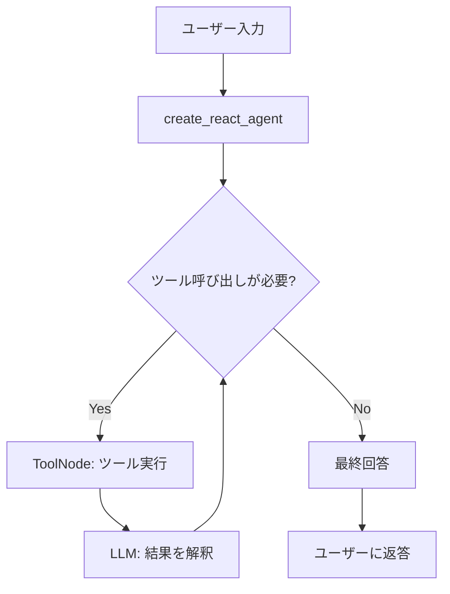
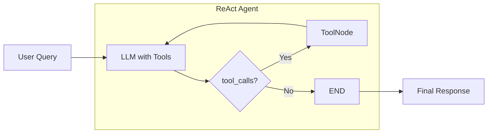

# blog_simple_react_agent

LangGraphとAzure OpenAIを使ったシンプルなReActエージェント実装です。
BraveSearchを使ったWeb検索機能と、MCP (Model Context Protocol) による拡張可能なツール連携をサポートしています。

## 特徴

- **ReActパターン**: LangGraphの`create_react_agent`を使用した推論と行動のサイクル
- **Azure OpenAI連携**: Azure OpenAIのGPTモデルを使用
- **Web検索**: BraveSearch APIによる検索機能
- **MCP対応**: オプションでMCPツール（Playwright、Chrome DevTools等）を利用可能
- **Langfuseトレース**: Langfuseによる実行トレース・モニタリング
- **対話モードとCLIモード**: インタラクティブな対話または単発クエリに対応

## プロジェクト構成

```
.
├── README.md                      # このファイル
├── requirements.txt               # Python依存関係
├── .env                          # 環境変数（要作成、Gitには含めない）
├── .gitignore                    # Git除外設定
├── src/
│   ├── react_agent.py            # メインエージェント実装
│   └── mcp_config.json           # MCPサーバー設定
├── server/
│   └── fishing_mcp/              # 釣り計画支援MCPサーバー
└── local_debug/                  # デバッグ・開発用フォルダ
```

## 主要ファイルの役割

| パス | 役割 |
| --- | --- |
| `src/react_agent.py` | ReActエージェントのメイン実装（Azure OpenAI、BraveSearch、MCP連携） |
| `src/mcp_config.json` | MCPサーバーの設定（Playwright、Chrome DevTools等） |
| `.env` | 環境変数（APIキー、エンドポイント等） |

## エージェントアーキテクチャ

### 基本フロー



### ReActサイクルの詳細



ReActエージェントは以下のステップを繰り返します：

1. **Reasoning（推論）**: LLMが現在の状態を分析し、次の行動を決定
2. **Action（行動）**: 必要に応じてツール（BraveSearch、MCP Tools等）を呼び出し
3. **Observation（観察）**: ツール実行結果を受け取り、状態を更新
4. **Loop**: ツール呼び出しが必要な限りステップ1-3を繰り返す
5. **Answer**: 最終的な回答を生成して返す

### 利用可能なツール

| ツール | 説明 | 有効化条件 |
| --- | --- | --- |
| BraveSearch | Web検索API（最大3件の検索結果） | 常時有効 |
| Playwright（MCP） | ブラウザ自動化・スクレイピング | `--use-mcp`フラグ指定時 |
| Chrome DevTools（MCP） | Chrome DevTools Protocol経由のブラウザ操作 | `--use-mcp`フラグ指定時 |
| Fishing MCP | 釣り計画支援（天気・潮汐・日の出日の入り情報） | `--use-mcp`フラグ指定時 |

## セットアップ

### 1. 環境変数の設定

`.env`ファイルをプロジェクトルートに作成し、以下の環境変数を設定してください：

```bash
# Azure OpenAI
AZURE_OPENAI_ENDPOINT=https://your-endpoint.openai.azure.com/
AZURE_OPENAI_API_VERSION=your_api_version
AZURE_OPENAI_API_KEY=your_api_key
AZURE_OPENAI_DEPLOYMENT_NAME=your_deployment_name

# BraveSearch
BRAVE_API_KEY=your_brave_api_key

# Langfuse (オプション)
LANGFUSE_PUBLIC_KEY=your_public_key
LANGFUSE_SECRET_KEY=your_secret_key
LANGFUSE_HOST=https://api.langfuse.com
```

### 2. 依存関係のインストール

```bash
python -m venv .venv
source .venv/bin/activate
pip install -r requirements.txt
```

### 3. MCPツールの準備（オプション）

MCPツールを使用する場合、以下のいずれかの方法でセットアップしてください：

- **Playwright (Docker)**: `docker pull mcp/playwright`
- **Playwright (npx)**: Node.js環境が必要
- **Chrome DevTools (npx)**: Node.js環境が必要
- **Fishing MCP**: 釣り計画支援ツール（詳細は`server/fishing_mcp/README.md`を参照）

設定は`src/mcp_config.json`で管理されています。

## 使い方

### 対話モード

```bash
python src/react_agent.py
```

対話的にエージェントと会話できます。終了するには`exit`と入力してください。

### 単発クエリモード

```bash
python src/react_agent.py "東京の天気は？"
```

### MCPツールを有効化

```bash
python src/react_agent.py "Pythonの公式サイトをスクレイピングして" --use-mcp
```

`--use-mcp`フラグを指定すると、`src/mcp_config.json`で設定されたMCPツールが利用可能になります。

## 実行例

```bash
(.venv) $ python src/react_agent.py こんにちは
INFO:websearch.agent:Langfuse CallbackHandler initialized successfully.
INFO:websearch.agent:AzureChatOpenAI initialized successfully.
INFO:websearch.agent:BraveSearch initialized with API key: BSAQqtDaVg***
INFO:websearch.agent:BraveSearch tool created: brave_search
INFO:websearch.agent:Loaded 1 tools: ['brave_search']
INFO:websearch.agent:User query: こんにちは
INFO:websearch.agent:Final response message count: 2
=================================
こんにちは！今日はどのようなお手伝いが必要ですか？ 😊
```

## 開発メモ

- **Langfuseトレース**: 環境変数が設定されていれば自動的に有効化されます
- **ログレベル**: `logging.basicConfig(level=logging.INFO)`で調整可能
- **MCP設定**: `src/mcp_config.json`で使用するMCPサーバーをカスタマイズできます
- **スレッドID**: グラフ実行時に`thread_id`を指定することで会話履歴を保持できます（現在は固定値`"12345"`）

## トラブルシューティング

### 環境変数が設定されていないエラー

```
RuntimeError: 必要な環境変数が設定されていません: ['AZURE_OPENAI_API_KEY']
```

→ `.env`ファイルを作成し、必要な環境変数を設定してください。

### BraveSearchが使えない

```
WARNING:websearch.agent:BRAVE_API_KEY is not set. BraveSearch tool will not be available.
```

→ `.env`ファイルに`BRAVE_API_KEY`を追加してください。

### MCPツールが起動しない

MCPツールにはDocker（Playwright）またはNode.js（npx系）が必要です。環境に応じて`src/mcp_config.json`を編集してください。

## ライセンス

本プロジェクトは個人的な学習・実験目的で作成されています。
